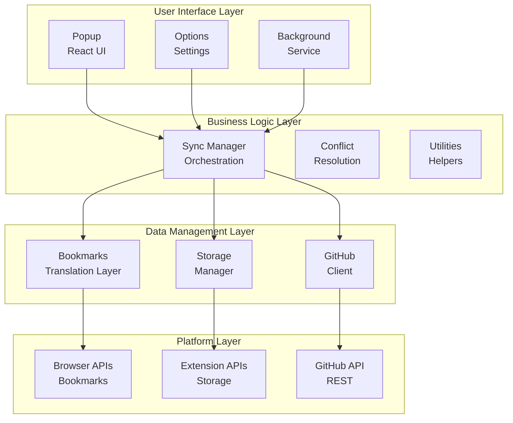

# HubMark Architecture Documentation

This directory contains architectural documentation for the HubMark extension, explaining how all the pieces work together to provide cross-browser bookmark synchronization with GitHub.

## Overview

HubMark is built using a layered architecture that abstracts browser differences and provides a robust sync engine:

## Documentation Structure

- **[Utilities Overview](./utilities/README.md)** - Core utilities and their relationships
- **[Storage Architecture](./utilities/storage.md)** - Extension storage management
- **[Bookmarks Translation Layer](./utilities/bookmarks.md)** - Cross-browser bookmark handling
- **[GitHub Integration](./utilities/github.md)** - Repository and file operations
- **[Sync Engine](./utilities/sync.md)** - Orchestration and conflict resolution
- **[Data Flow](./data-flow.md)** - How data moves through the system
- **[Testing Strategy](./testing.md)** - Comprehensive test coverage approach

## Key Design Principles

1. **Cross-Browser Compatibility**: Abstract browser API differences behind consistent interfaces
2. **Stable Identity**: Use content-based IDs that survive browser migrations
3. **Conflict Resolution**: Handle concurrent modifications gracefully
4. **Extensible Storage**: Support multiple sync targets beyond GitHub
5. **Offline Resilience**: Queue operations when network is unavailable
6. **Privacy First**: All data encrypted, user controls sync scope

## Getting Started

1. Start with [Utilities Overview](./utilities/README.md) for the foundation
2. Review [Data Flow](./data-flow.md) to understand the sync process
3. Check [Testing Strategy](./testing.md) for development practices