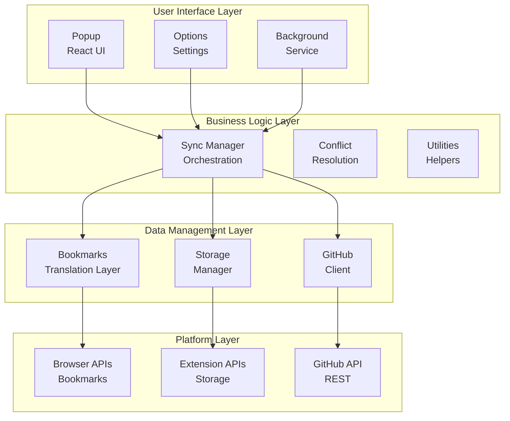

# HubMark Architecture Documentation

This directory contains architectural documentation for the HubMark extension, explaining how all the pieces work together to provide cross-browser bookmark synchronization with GitHub.

## Overview

HubMark is built using a layered architecture that abstracts browser differences and provides a robust sync engine:

## Documentation Structure

### Core Architecture
- **[JSON-First Storage Architecture](./json-architecture.md)** - Modern JSON-first storage with generated Markdown views
- **[Browser-Safe Base64 Encoding](./browser-safe-base64.md)** - MV3-compatible base64 encoding for GitHub API operations
- **[API Reference](./api-reference.md)** - Detailed API documentation for all components
- **[Data Flow](./data-flow.md)** - How data moves through the system
- **[Testing Strategy](./testing.md)** - Comprehensive test coverage approach

### Legacy Architecture (Pre-JSON)
- **[Utilities Overview](./utilities/README.md)** - Core utilities and their relationships
- **[Storage Architecture](./utilities/storage.md)** - Extension storage management
- **[Bookmarks Translation Layer](./utilities/bookmarks.md)** - Cross-browser bookmark handling
- **[GitHub Integration](./utilities/github.md)** - Repository and file operations
- **[Sync Engine](./utilities/sync.md)** - Orchestration and conflict resolution

## Key Design Principles

### JSON-First Architecture (Current)
1. **Single Source of Truth**: JSON data with generated Markdown views
2. **Stable Identity**: Deterministic content-based IDs (no timestamps)
3. **Conflict Resolution**: 3-way merge with configurable strategies
4. **Schema Validation**: Strict JSON schema enforcement with Ajv
5. **MV3 Compliance**: Browser-safe operations for service workers
6. **Browser-Safe Encoding**: Native Web API base64 encoding (no Node.js Buffer)
7. **Data Integrity**: Atomic operations with retry logic

### Legacy Principles
1. **Cross-Browser Compatibility**: Abstract browser API differences behind consistent interfaces
2. **Extensible Storage**: Support multiple sync targets beyond GitHub
3. **Offline Resilience**: Queue operations when network is unavailable
4. **Privacy First**: All data encrypted, user controls sync scope

## Getting Started

### For JSON-First Architecture (Recommended)
1. Start with [JSON-First Storage Architecture](./json-architecture.md) for the modern approach
2. Review [Browser-Safe Base64 Encoding](./browser-safe-base64.md) for MV3 compatibility details
3. Check [API Reference](./api-reference.md) for detailed implementation docs
4. Review [Testing Strategy](./testing.md) for development practices

### For Legacy Architecture
1. Start with [Utilities Overview](./utilities/README.md) for the foundation
2. Review [Data Flow](./data-flow.md) to understand the sync process