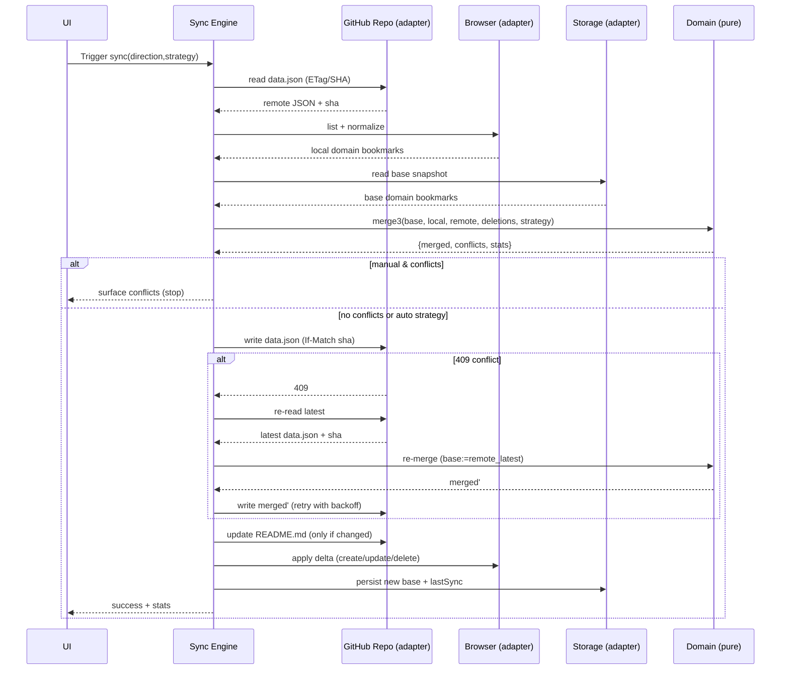
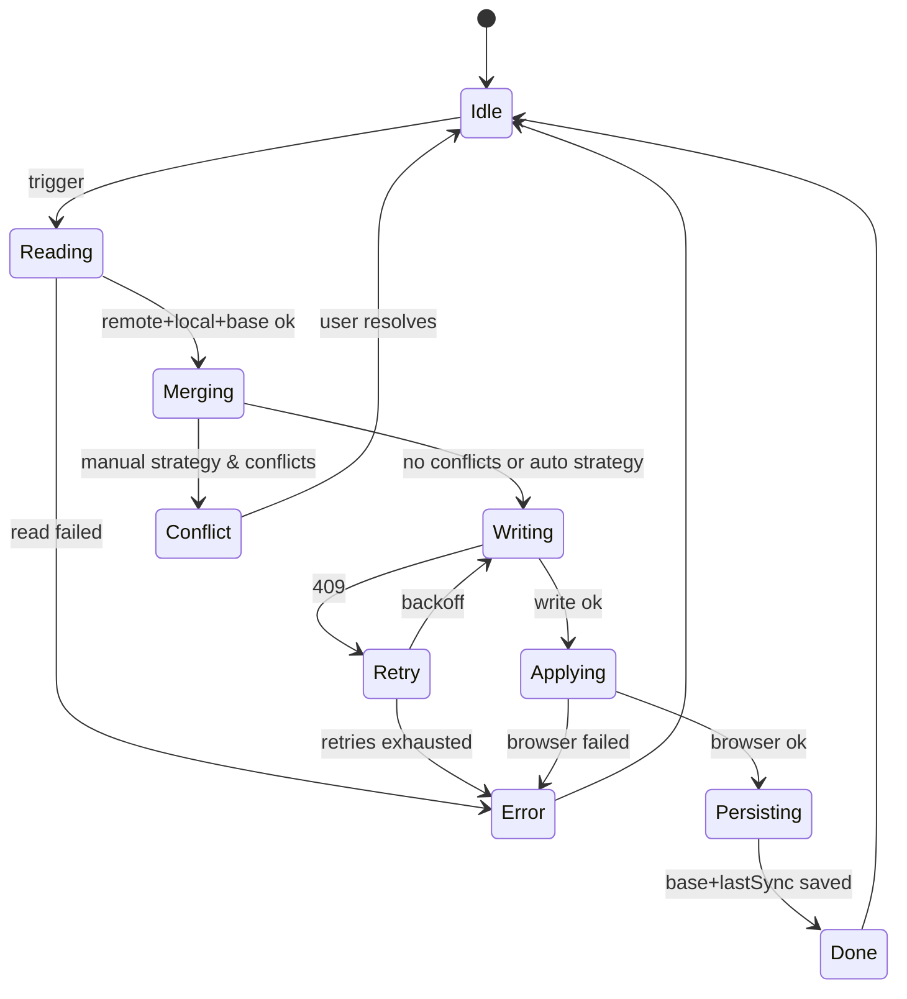

# HubMark – First Principles Architecture (Deep Dive)

This document explains the rationale behind stable IDs, content hashing, and optional HMAC; then provides a deep dive of a clean, composable architecture and how recommended unjs.io packages fit in. It ends with end‑to‑end diagrams to make the flow concrete.

## Why Stable 32‑char IDs, Content Hashes, and HMAC

### Stable 32‑char IDs (`hm_<sha256>`) — the backbone of sync
- **Determinism:** The same logical bookmark (canonical URL + normalized title) must map to the same ID on every device and on every run. That lets you match items reliably without ambient state.
- **Cross‑adapter independence:** Browser bookmark IDs differ across browsers and sessions. A stable HubMark ID decouples your data model from any vendor API.
- **Conflict detection & merging:** A 3‑way merge needs stable, persistent keys to line up “base/local/remote” items. Without stable IDs you’re guessing.
- **Schema invariants:** A 32‑char (hex) SHA‑256 prefix (`hm_`) gives you high collision resistance, compactness, and a simple validation rule (`^hm_[a-f0-9]{32}$`).
- **Future‑proofing:** SHA‑256 is standard, widely available in Web Crypto, and has far lower collision risk than small integer/string hashes.

Why 32 hex chars and not base36? Simplicity and readability in logs, plus trivial validation. Truncation to 32 preserves adequate collision resistance for the expected scale (millions) while staying compact.

### Content hashes — fast, field‑level change detection
- **No‑op writes:** Compute a content hash of meaningful fields (title, url, folder, tags, notes, archived, favorite; exclude dates). If unchanged, skip writes to GitHub and local browser → saves rate limit and latency.
- **Selective updates:** Per‑bookmark content hash lets you detect modifications quickly in the browser adapter so you update only what changed.
- **Cheap comparisons:** Hashes allow quick map/set membership and reduce deep object comparisons in hot paths.

Content hash does not replace the stable ID; it’s a transient optimization for equality checks and dirty detection.

### Optional HMAC — privacy and preimage resistance
- **Problem:** A plain SHA‑256 over `canonicalUrl + "\n" + normalizedTitle` is deterministic and could leak sensitive URLs via the ID if an attacker guesses inputs (preimage attack).
- **Solution:** Use HMAC‑SHA‑256 with a per‑user secret key to derive IDs. That makes IDs unlinkable to the raw input without the key.
- **Trade‑offs:** IDs become user‑specific (not shareable across users); migration is needed if the key rotates. Keep HMAC optional and off by default; it’s a nice privacy lever for sensitive repos.

---

## Architecture – Functional Core, Imperative Shell

### Layers
- **Domain (pure):** Types, normalization, ID/content hashing, JSON ↔ domain transforms, merge3, markdown rendering.
- **Application (orchestration):** Sync engine as a small state machine (idle → read → merge → write → apply → done/error). Policies (strategy, backoff, direction) are inputs.
- **Adapters (effects):** GitHub repo client (read/write data.json, README.md), Browser bookmarks (CRUD & traversal), Storage (settings, base snapshot), Messaging.
- **UI:** Options (setup & settings), Popup (status & action). Hooks are thin RPC wrappers with typed messages.

### Data Model
- `BookmarksData` (JSON Schema validated):
  - `schemaVersion: 1`, `generatedAt`, `bookmarks: Bookmark[]`, `meta`.
- `Bookmark`: `id` (hm_… 32 hex), `title`, `url`, `folder`, `tags[]`, `notes`, `dateAdded`, `dateModified`, `archived`, `favorite`.

### Core Pure Functions (no effects)
- `canonicalUrl(url)`, `normalizeTitle(title)`
- `generateStableId(url, title)` (SHA‑256; optional HMAC)
- `generateContentHash(bookmark)` (ignoring dates)
- `jsonToDomain(json)`, `domainToJson(domain)`
- `diff(a, b)`, `computeDeletions(base, next)`
- `merge3(base, local, remote, deletions, strategy)` → `{ merged, conflicts, stats }`
- `renderReadme(data)`

### Sync Engine (deterministic, composable)
- Inputs: `base`, `local`, `remote`, `direction`, `strategy`, `retryPolicy`.
- Steps:
  1) Read remote JSON + base snapshot, validate against schema
  2) Compute deletions (base vs local, base vs remote)
  3) Merge via `merge3`
  4) If manual and conflicts remain → surface; else write
  5) Write data.json with optimistic concurrency; on 409: re‑read → re‑merge → retry (backoff)
  6) Render/update README.md only if content changed
  7) Apply merged to browser (delta only)
  8) Persist new base and lastSync

---

## unjs.io Packages – Where They Fit

- **ufo** (URL utilities)
  - Use in `canonicalUrl`: normalize protocol/host, trim paths, drop tracking params, strip hashes.
  - Replaces hand‑rolled regex and edge‑case drift.
- **uncrypto** (Universal crypto)
  - Use in `generateStableId` & `generateContentHash`: SHA‑256 (and HMAC‑SHA‑256 if privacy is enabled).
  - Gives uniform behavior across browser/Node and tests.
- **defu** (Deep defaults)
  - Use for settings & policy objects: `effective = defu(userSettings, defaultSettings)`.
  - Fewer manual merges; predictable precedence.
- **consola** (Structured logging)
  - Use in Sync Engine and adapters: leveled, consistent logs with correlation IDs per sync.
  - Toggle verbosity via env switches.
- **hookable** (Lifecycle hooks)
  - Expose `beforeRead`, `afterMerge`, `beforeWrite`, `afterWrite`, `beforeApply`, `afterApply` hooks.
  - Enables observability and extension points without muddying core logic.
- **unstorage** (Universal KV with drivers)
  - Abstract storage (settings, base snapshot, lastSync). Write a tiny chrome.storage driver; swap in-memory for tests.
  - Decouples app code from WebExtensions API.
- **destr** (Safe JSON.parse)
  - Optional: resilient config parsing before Ajv validation (never for your canonical data.json — keep that strict).
- **ohash** (Fast non‑crypto hashes)
  - Optional: quick dirty checks (e.g., in‑memory caches). Keep SHA‑256 for IDs and persistent content hashing.

---

## How It Fits Together (Diagrams)

### Component View
```mermaid
flowchart LR
  UI[UI: Popup/Options]
  Hooks[React Hooks]
  App[Application: Sync Engine]
  Dom[Domain (pure)]
  GH[Adapter: GitHub Repo]
  BR[Adapter: Browser Bookmarks]
  ST[Adapter: Storage]

  UI -- RPC --> Hooks -- typed msgs --> App
  App -- calls --> Dom
  App -- read/write --> GH
  App -- apply delta --> BR
  App -- base/lastSync/settings --> ST

  subgraph unjs packages
    UFO[ufo]
    UNCR[uncrypto]
    DF[defu]
    CONS[consola]
    HK[hookable]
    UST[unstorage]
  end

  Dom -- url canon --> UFO
  Dom -- sha256/hmac --> UNCR
  App -- logging --> CONS
  App -- lifecycle --> HK
  ST -- kv api --> UST
  App -- defaults --> DF
```

### Sync Sequence (Bidirectional)


### Sync Engine State Machine


---

## Implementation Sketch (Key Points)

- Domain is dependency-free, pure, and thoroughly unit‑tested.
- App/Sync Engine composes pure functions with adapters and policies; no logic in UI/adapters.
- Adapters are thin and mockable; tests are contract tests (fixtures + assertions on calls/returns).
- unjs packages replace brittle glue: ufo (URLs), uncrypto (hashing), defu (defaults), consola (logs), hookable (hooks), unstorage (KV).
- Everything is deterministic and idempotent; no “best effort” hidden behavior.

This approach keeps the core easy to reason about, enables high‑quality tests, and minimizes bugs that typically plague cross‑device sync systems.

