# Data Flow Architecture

This document explains how data flows through the HubMark extension during different operations, showing the interaction between utilities and external systems in our JSON-first architecture.

## Overall Data Flow

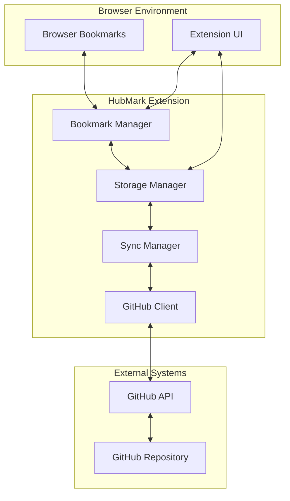

## JSON-First Sync Operation Flows

### 1. Browser to GitHub Sync

When a user adds/modifies a bookmark in their browser:

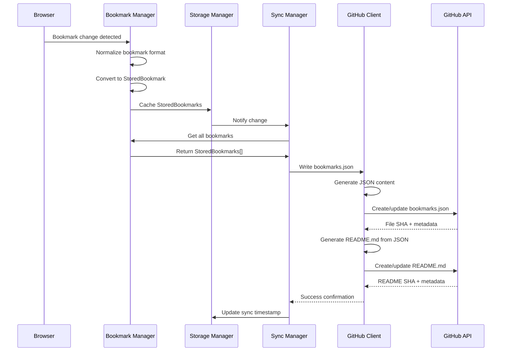

### 2. GitHub to Browser Sync

When bookmarks are modified in the GitHub repository:

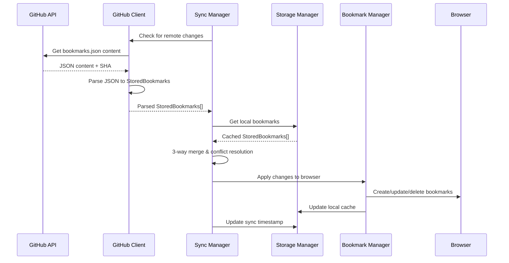

## Data Format Transformations

### Browser Bookmark → StoredBookmark → GitHub JSON

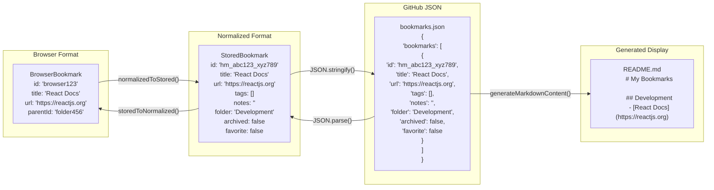

## ID Management Flow

### Stable ID Generation and Mapping

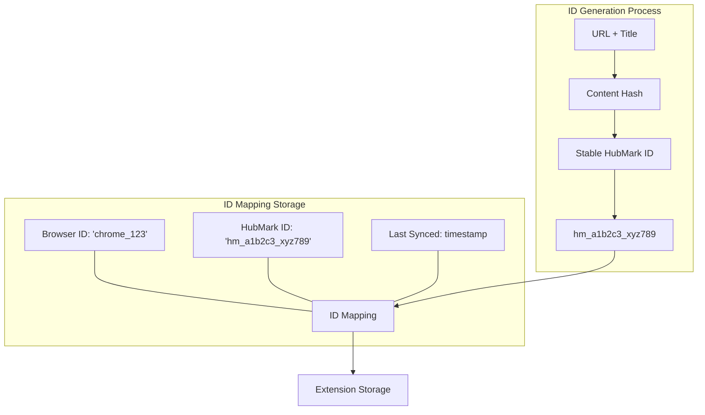

### Cross-Browser ID Stability

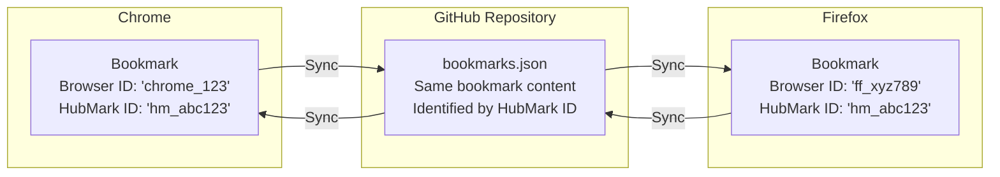

## Conflict Resolution Flow

### 3-Way Merge Process

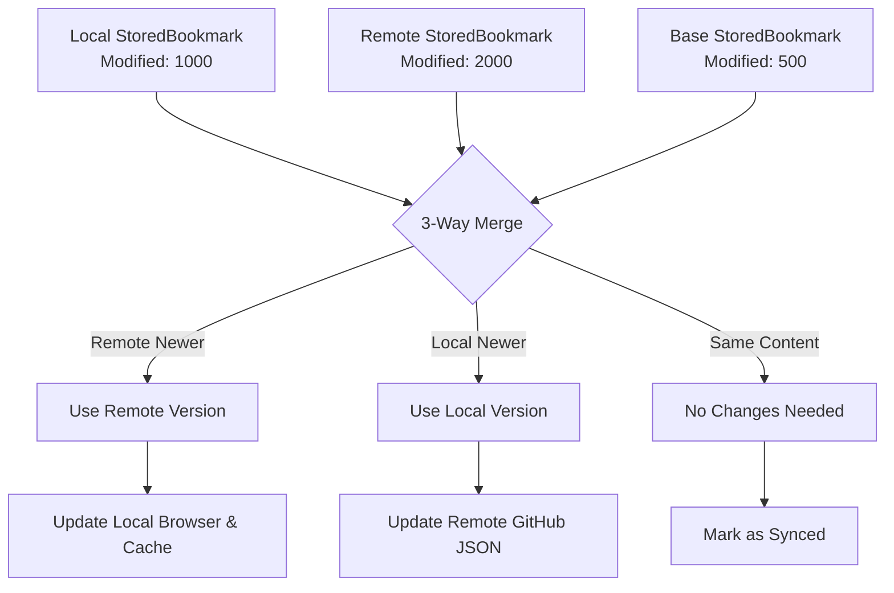

### Conflict Detection Process

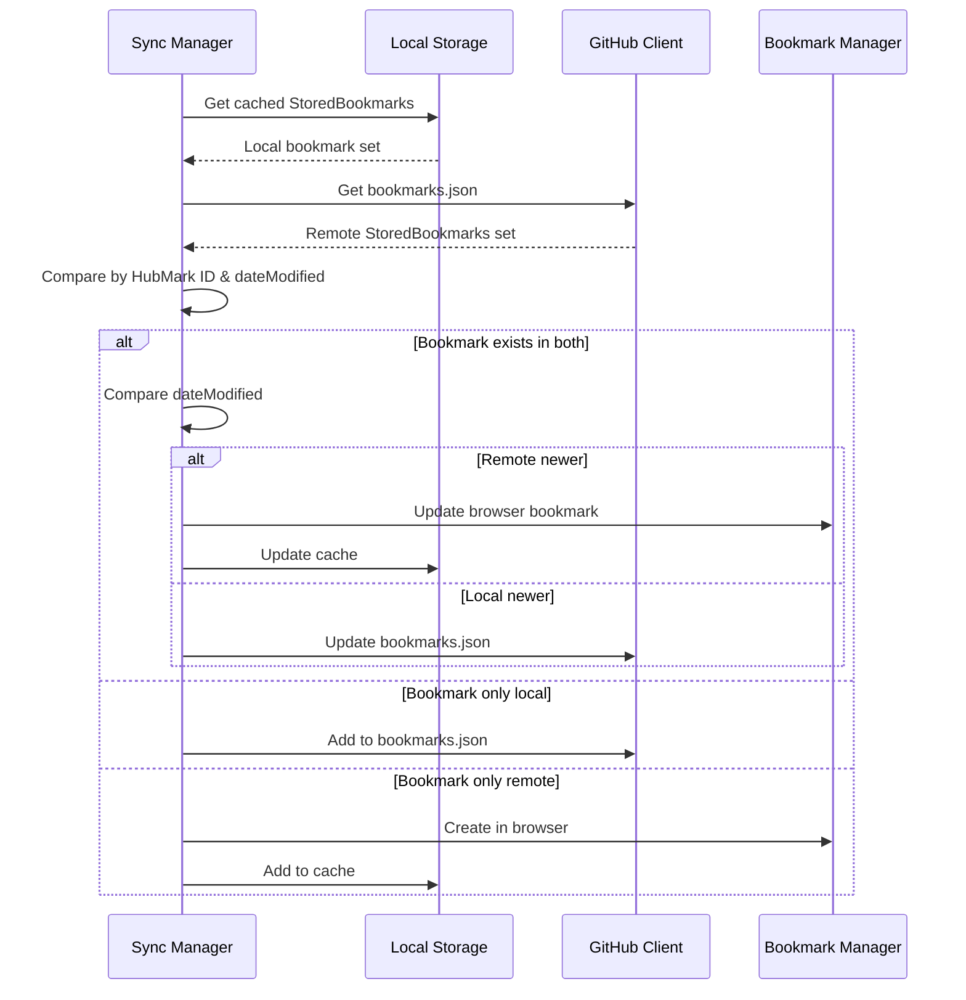

## JSON-First Sync Scheduling

### Automatic Sync Triggers

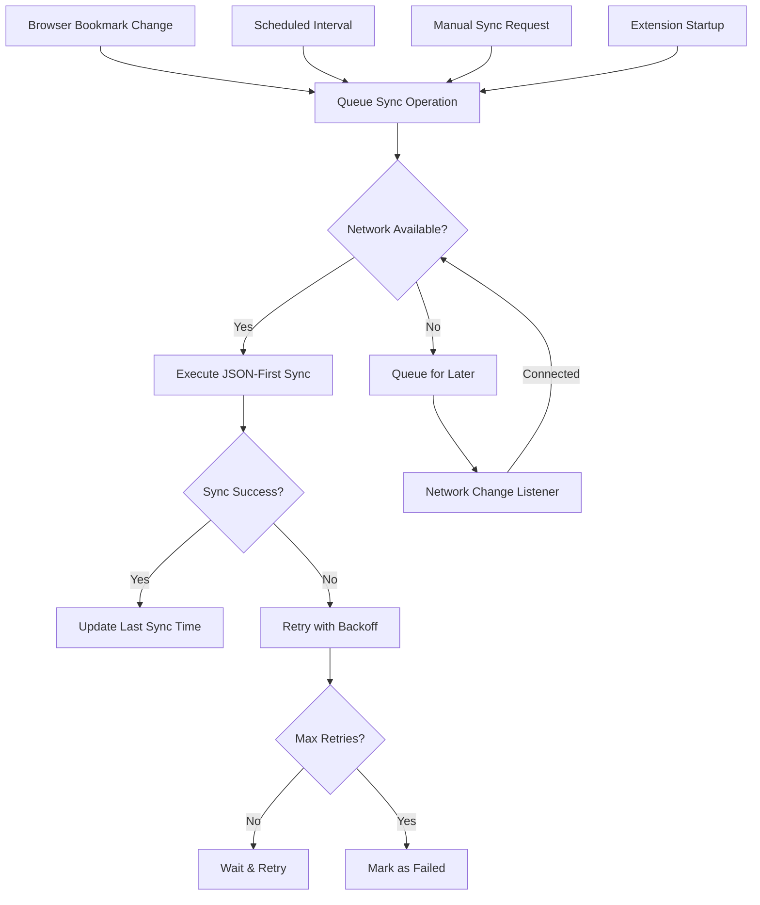

## Error Handling Flow

### Network and API Error Recovery

## Storage Layer Interactions

### Extension Storage Usage

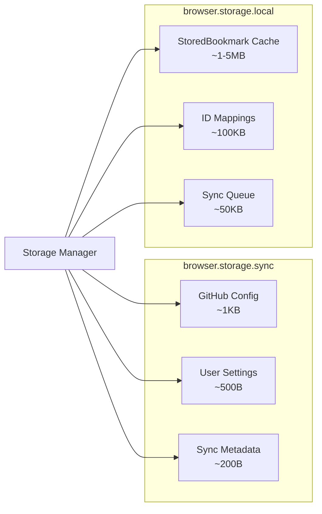

### Data Persistence Strategy

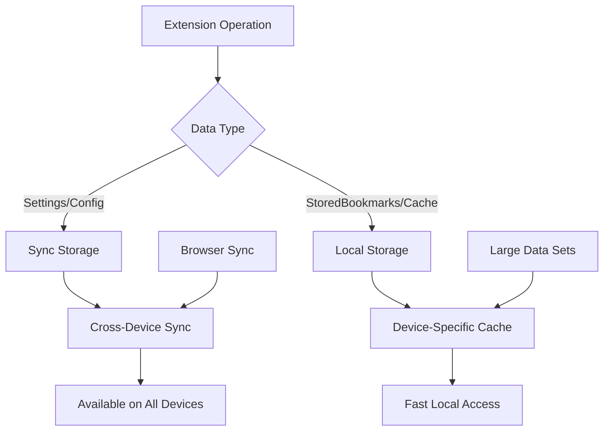

## Performance Optimization Flows

### Batch Operations

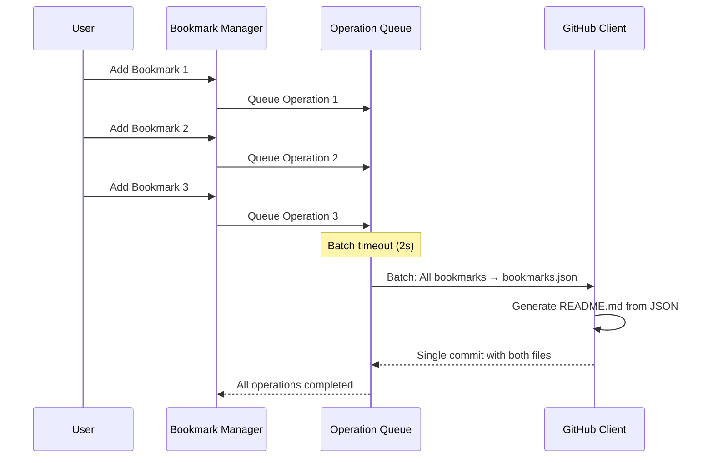

### JSON-First Caching Strategy

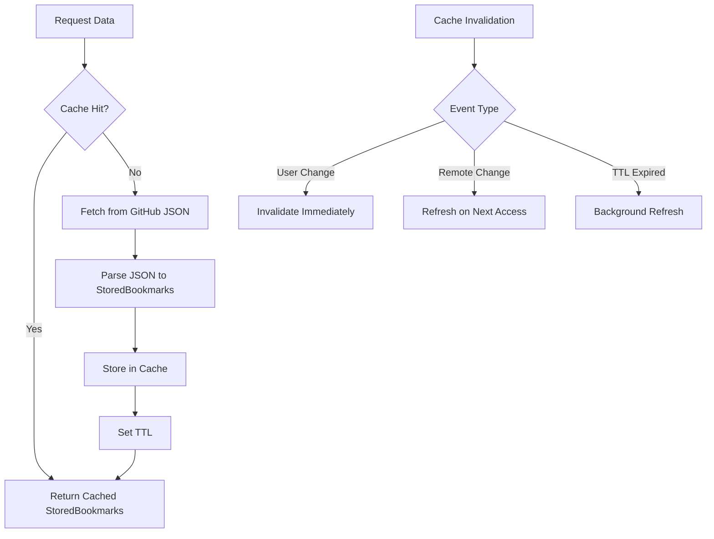

## Benefits of JSON-First Data Flow

### ✅ **Data Integrity**
- Schema validation at every step
- Structured data prevents parsing errors
- Atomic JSON operations

### ✅ **Performance**
- Efficient JSON parsing vs. fragile Markdown parsing
- Single source of truth reduces complexity
- Minimal API calls (write only when changed)

### ✅ **Extensibility**
- Easy to add new bookmark metadata fields
- Multiple output formats from same JSON
- Schema versioning for migrations

### ✅ **Reliability**
- Deterministic conflict resolution
- Complete dataset operations
- 3-way merge prevents data loss

This JSON-first data flow architecture provides a robust, scalable foundation for cross-browser bookmark synchronization while maintaining human-readable display through auto-generated Markdown.