# Data Flow Architecture

This document explains how data flows through the HubMark extension during different operations, showing the interaction between utilities and external systems.

## Overall Data Flow

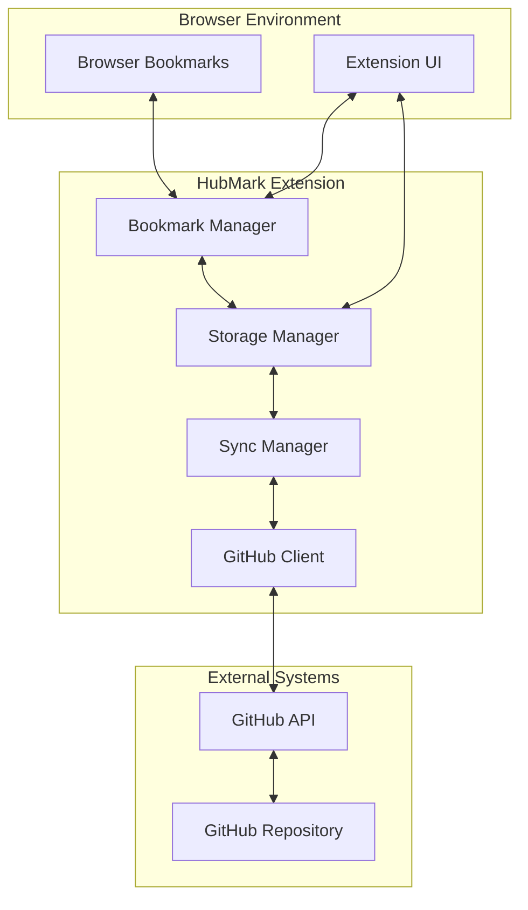

## Sync Operation Flows

### 1. Browser to GitHub Sync

When a user adds/modifies a bookmark in their browser:

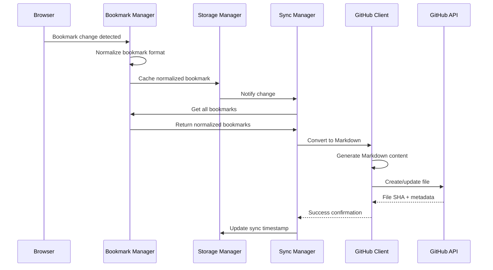

### 2. GitHub to Browser Sync

When bookmarks are modified in the GitHub repository:

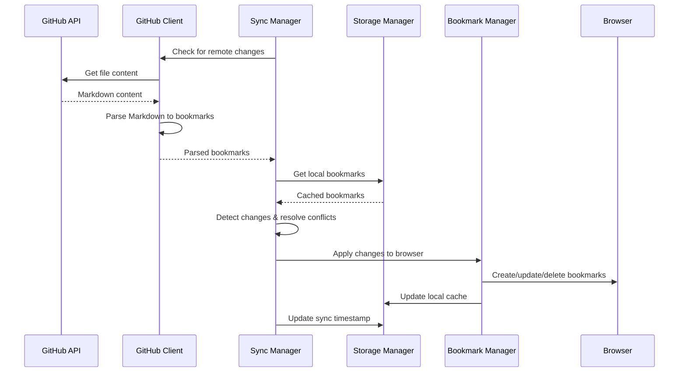

## Data Format Transformations

### Browser Bookmark → Normalized → GitHub

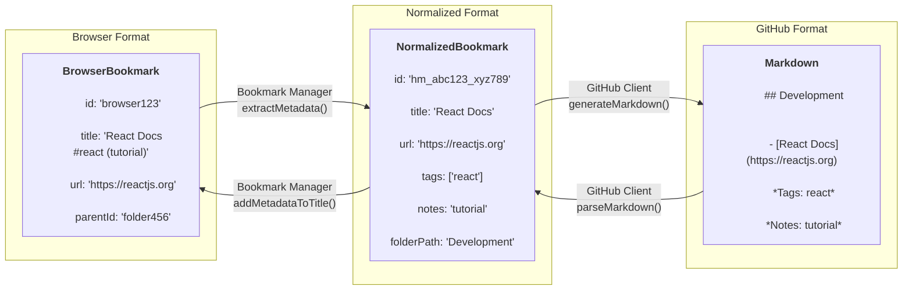

## ID Management Flow

### Stable ID Generation and Mapping

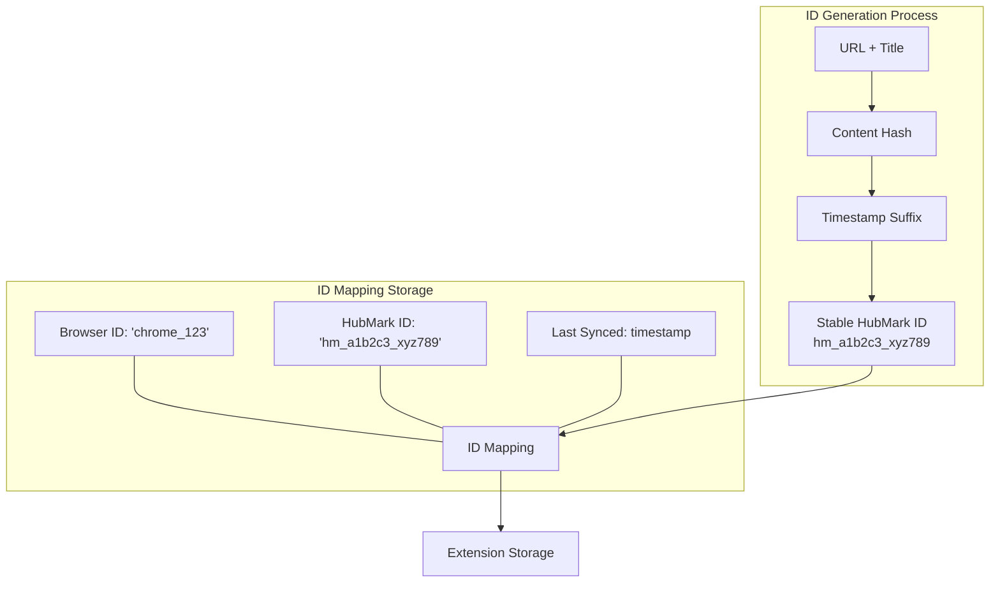

### Cross-Browser ID Stability

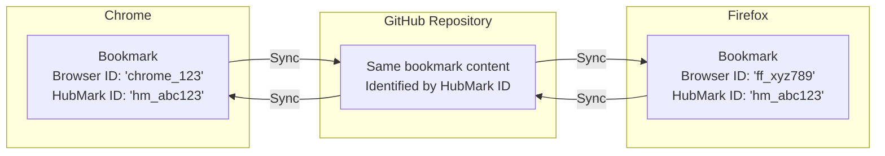

## Conflict Resolution Flow

### Timestamp-Based Resolution

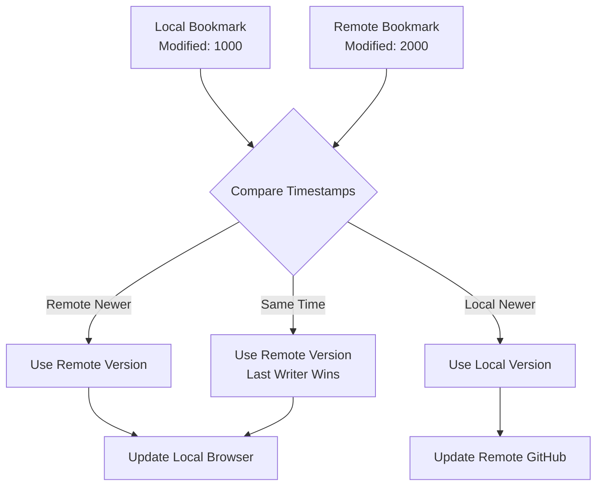

### Conflict Detection Process

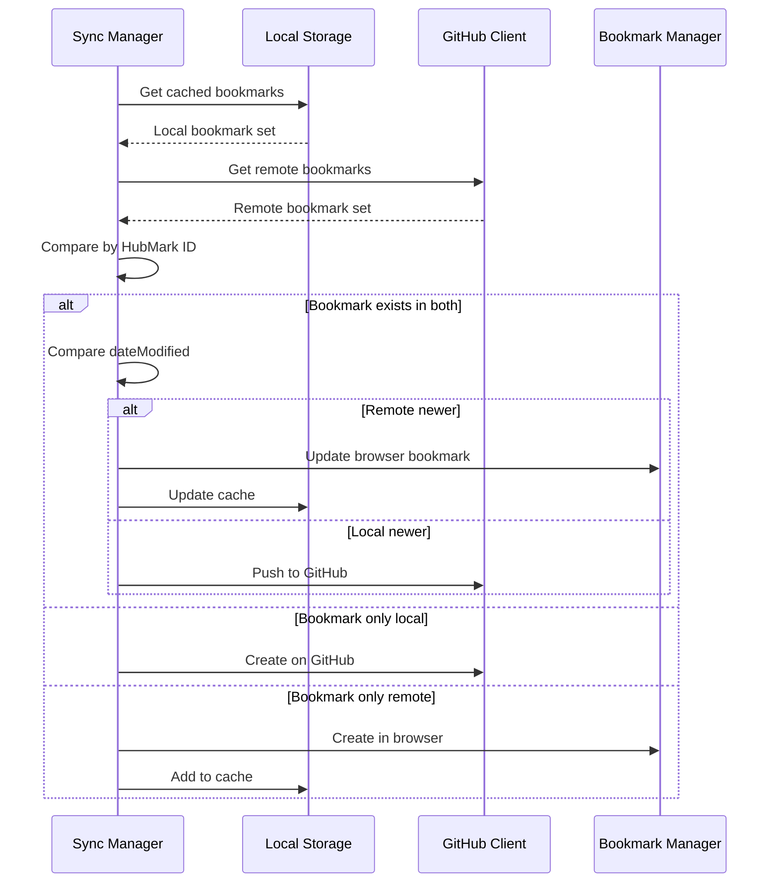

## Sync Scheduling and Queuing

### Automatic Sync Triggers

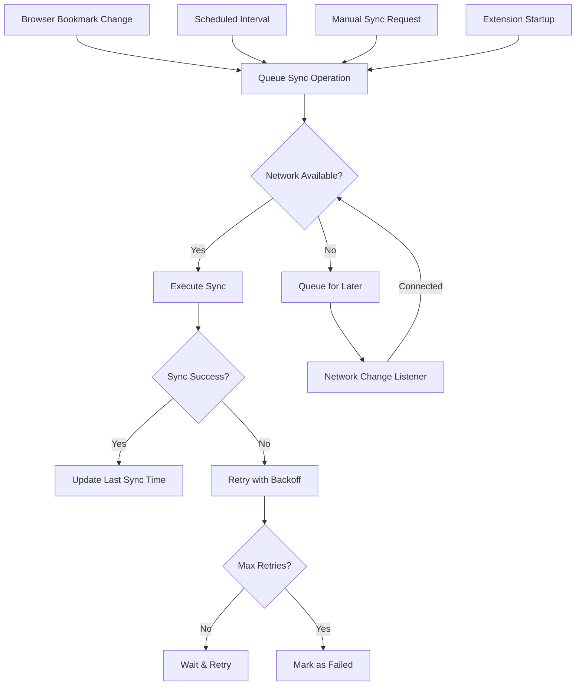

## Error Handling Flow

### Network and API Error Recovery

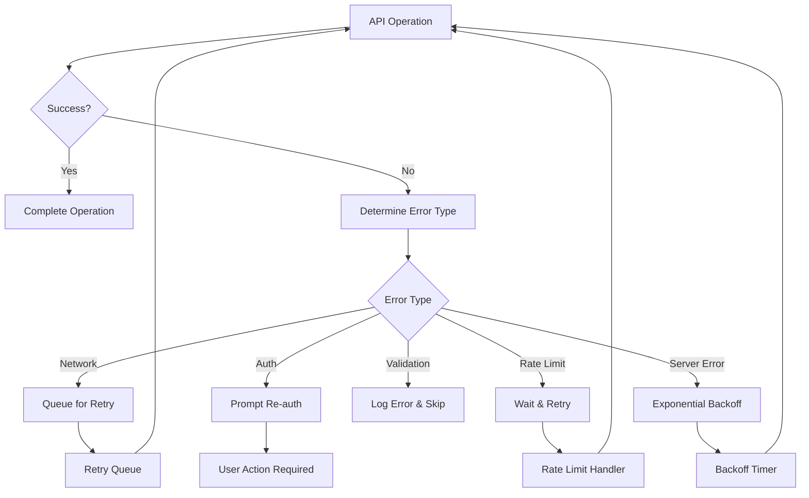

## Storage Layer Interactions

### Extension Storage Usage

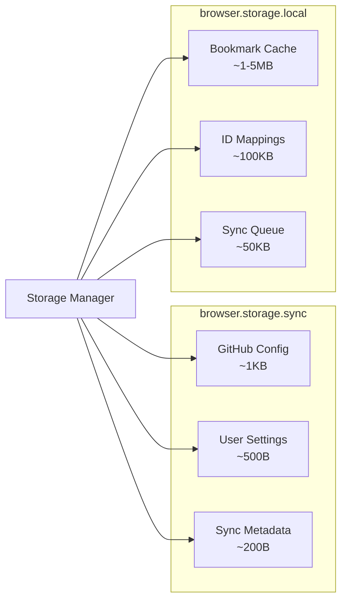

### Data Persistence Strategy

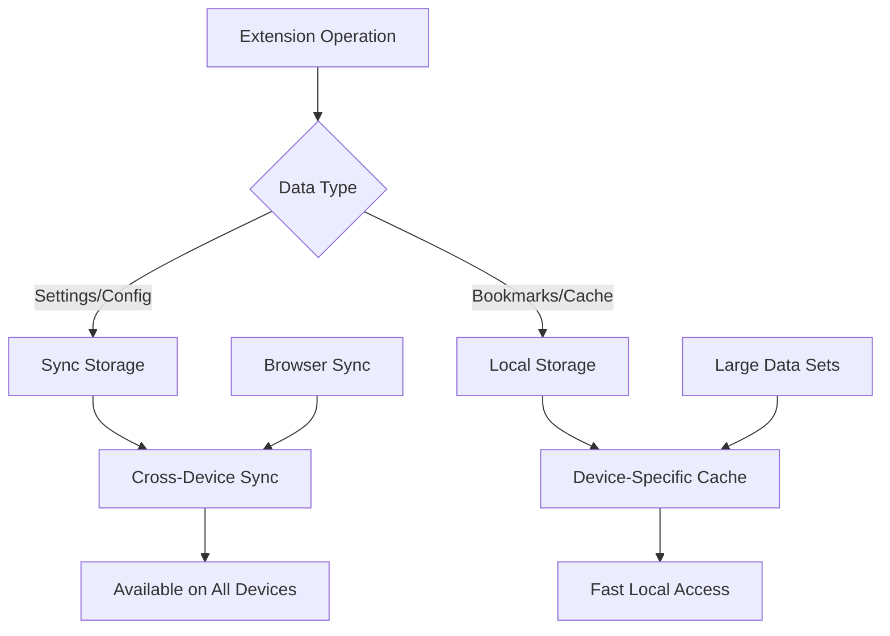

## Performance Optimization Flows

### Batch Operations

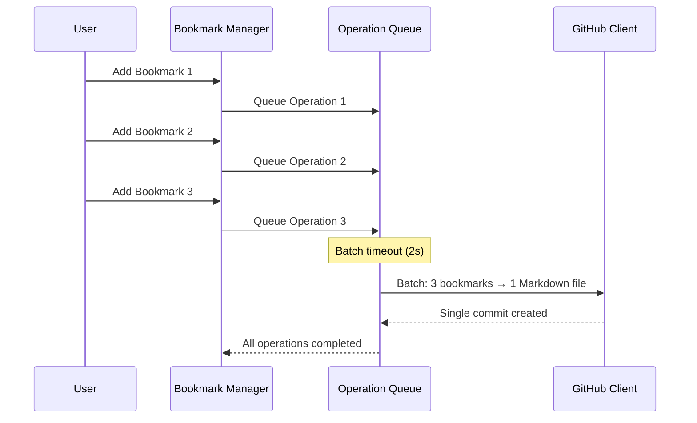

### Caching Strategy

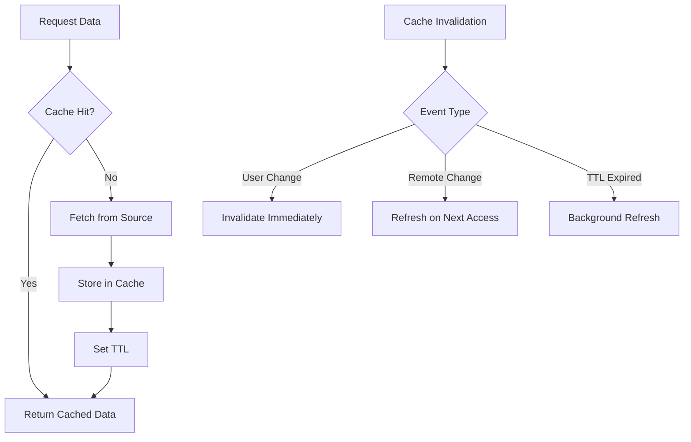

This data flow documentation provides a comprehensive view of how data moves through the HubMark system, enabling developers to understand the synchronization process, conflict resolution, and performance optimizations.