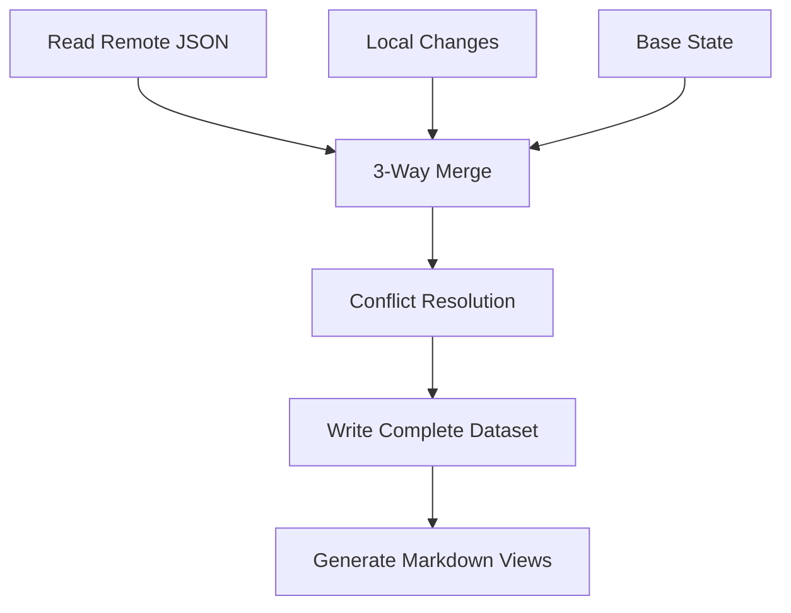

# JSON-First Storage Architecture

## Overview

HubMark has transitioned from a Markdown-first storage approach to a JSON-first architecture. This change provides better data integrity, reliable sync operations, and the ability to generate multiple presentation formats while maintaining a single source of truth.

## Architecture Principles

### 1. **Single Source of Truth**
- All bookmark data is stored in structured JSON format (`bookmarks.json`)
- Markdown files are generated views, never edited directly
- JSON schema validation ensures data integrity

### 2. **Stable Identification**
- Deterministic bookmark IDs based on content hash (no timestamps)
- Consistent identification across devices and sync operations
- URL canonicalization for robust matching

### 3. **Conflict Resolution**
- 3-way merge algorithm with configurable strategies
- Proper handling of concurrent modifications
- Exponential backoff retry on write conflicts

## File Structure

```
GitHub Repository:
├── bookmarks.json         # 📊 Single source of truth (structured data)
├── README.md              # 📖 Generated human-readable view
└── (future: additional generated views)
```

## JSON Schema

### Data Structure

The canonical data structure follows this schema:

```json
{
  "schemaVersion": 1,
  "generatedAt": "2023-09-05T12:00:00.000Z",
  "bookmarks": [
    {
      "id": "hm_2f0b9c1f6d1e7f2b5c7a2b1a9d3c4e5f",
      "title": "React Documentation",
      "url": "https://reactjs.org",
      "folder": "Development/Frontend",
      "tags": ["react", "javascript"],
      "notes": "Great reference for TS",
      "dateAdded": 1693929600000,
      "dateModified": 1693929600000,
      "archived": false,
      "favorite": false
    }
  ],
  "meta": {
    "generator": "HubMark",
    "generatorVersion": "0.1.0",
    "lastSync": 1693929600000
  }
}
```

### Schema Validation

- **Strict validation** using [Ajv](https://ajv.js.org/) JSON Schema validator
- **Required fields**: `schemaVersion`, `bookmarks` (each bookmark requires `id`, `title`, `url`, `dateAdded`, `dateModified`)
- **Type safety**: Strong typing with TypeScript interfaces
- **Additional properties**: Rejected to prevent schema drift

## Stable ID Generation

### Algorithm

Bookmark IDs are generated using a deterministic algorithm:

1. **URL Canonicalization**: Normalize URL format for consistent matching
2. **Title Normalization**: Clean up whitespace and formatting
3. **Composite Key**: Combine canonical URL and normalized title
4. **Hash Generation**: Create SHA-256 hash of composite key
5. **ID Format**: Prefix with `hm_` and truncate to 32 characters

### URL Canonicalization Rules

```typescript
// Input:  "HTTP://www.Example.com/path/?utm_source=test&ref=social#section"
// Output: "https://example.com/path"
```

**Transformations:**
- Convert hostname to lowercase
- Remove `www.` prefix
- Promote HTTP to HTTPS (configurable)
- Remove tracking parameters (`utm_*`, `gclid`, `fbclid`, etc.)
- Remove hash fragments
- Remove trailing slashes (except root)

### Benefits

- **Consistency**: Same URL variations produce identical IDs
- **Stability**: No timestamps means IDs never change for same content
- **Conflict Resolution**: Reliable matching across sync operations
- **Deduplication**: Automatic detection of duplicate bookmarks

## Sync Algorithm

### Read-Merge-Write Pattern



### Merge Process

1. **Read Phase**
   - Fetch `bookmarks.json` from GitHub
   - Handle 404 (new repository) gracefully
   - Validate JSON schema

2. **Merge Phase**
   - Create maps by bookmark ID for efficient lookup
   - Apply local additions/modifications
   - Apply deletions
   - Detect conflicts using 3-way comparison

3. **Conflict Resolution**
   - **Latest-wins**: Compare `dateModified` timestamps
   - **Local-wins**: Prefer local changes
   - **GitHub-wins**: Prefer remote changes  
   - **Manual**: Surface conflicts for user resolution

4. **Write Phase**
   - Validate merged dataset against schema
   - Write complete bookmark set to `bookmarks.json`
   - Retry on 409 conflicts with exponential backoff
   - Generate markdown views only if content changed

### Conflict Handling

```typescript
interface BookmarkConflict {
  id: string;
  local: HubMarkBookmark;    // Local version
  remote: HubMarkBookmark;   // Remote version  
  base?: HubMarkBookmark;    // Last known common version
}
```

**3-Way Merge Logic:**
- If only local changed: use local
- If only remote changed: use remote
- If both changed: apply conflict resolution strategy
- If content identical: no conflict

## Browser-Safe Implementation

### MV3 Compatibility

**Base64 Encoding** (replaces Node.js Buffer):

HubMark implements browser-safe base64 encoding to ensure MV3 service worker compatibility. See [Browser-Safe Base64 Encoding](./browser-safe-base64.md) for complete details.

```typescript
import { encodeBase64, decodeBase64 } from '~/utils/base64';

// Encode for GitHub API (MV3 compatible)
const encoded = encodeBase64(jsonContent);

// Decode from GitHub API (handles Unicode correctly)
const decoded = decodeBase64(encodedContent);
```

**Key Features:**
- ✅ **No Node.js Buffer**: Uses native Web APIs (`btoa`, `atob`, `encodeURIComponent`)
- ✅ **Unicode Support**: Handles emojis and international characters correctly
- ✅ **MV3 Service Workers**: Works in isolated service worker contexts
- ✅ **GitHub API Compatible**: Produces valid base64 for API operations
- ✅ **Error Handling**: Graceful handling of malformed input

**Crypto Operations**:
- Uses Web Crypto API (`crypto.subtle.digest`)
- No dependency on Node.js crypto module
- Works in service workers and main thread

## Markdown Generation

### README.md Structure

Generated README includes:
- **Header**: Title and generation timestamp
- **Statistics**: Total bookmark count
- **Folder Organization**: Bookmarks grouped by folder
- **Favorites**: Special marking for favorite bookmarks ⭐
- **Tags**: Inline tag display with backticks
- **Archived Section**: Collapsible section for archived bookmarks
- **Footer**: Note about auto-generation

### Example Output

```markdown
# My Bookmarks

*Generated by HubMark on 9/5/2023*

Total bookmarks: 42

## Development/Frontend

- [React Documentation](https://reactjs.org) ⭐ `react` `javascript`
  > Great reference for TS
- [Vue.js Guide](https://vuejs.org/guide/)

## Archived (5)

<details>
<summary>Show archived bookmarks</summary>

- [Old Framework](https://example.com/old)

</details>

---

*This file is automatically generated from [bookmarks.json](./bookmarks.json). Do not edit directly.*
```

## Migration Strategy

### From Markdown to JSON

For existing repositories with `bookmarks.md`:

1. **Detection**: Check if `bookmarks.json` exists
2. **Parsing**: Best-effort parse of existing Markdown
3. **Validation**: Generate valid JSON structure
4. **Backup**: Rename original to `bookmarks-legacy.md`
5. **Generation**: Create new README from JSON

### From Node.js Buffer to Browser-Safe Base64

The extension has been updated to use MV3-compatible base64 encoding:

**Before (broken in MV3):**
```typescript
// ❌ Crashes in service workers
const encoded = Buffer.from(content, 'utf8').toString('base64');
const decoded = Buffer.from(encoded, 'base64').toString('utf8');
```

**After (MV3 compatible):**
```typescript
// ✅ Works in all browser contexts
import { encodeBase64, decodeBase64 } from '~/utils/base64';

const encoded = encodeBase64(content);
const decoded = decodeBase64(encoded);
```

**Migration Benefits:**
- ✅ **MV3 Service Worker Support**: No more `Buffer is not defined` errors
- ✅ **Unicode Preservation**: Handles international text and emojis correctly
- ✅ **Performance**: Native Web API calls are faster than polyfills
- ✅ **GitHub API Compatibility**: Produces valid base64 for all GitHub operations
- ✅ **Error Handling**: Graceful failure with detailed error messages

See [Browser-Safe Base64 Encoding](./browser-safe-base64.md) for complete migration guide and technical details.

### Schema Evolution

Future schema versions will:
- Increment `schemaVersion` field
- Maintain backward compatibility  
- Provide migration utilities
- Validate against appropriate schema version

## API Reference

### Core Classes

#### `JSONGitHubClient`

Main client for JSON-first GitHub operations:

```typescript
const client = new JSONGitHubClient(githubConfig);

// Read bookmark data
const { data, sha } = await client.readBookmarkData();

// Write with conflict retry
const newSha = await client.writeBookmarkData(data, message, sha);

// 3-way merge
const result = await client.mergeBookmarks(base, local, remote, deletions, strategy);

// Generate views
await client.updateReadmeIfChanged(data);
```

#### `SchemaValidator`

JSON schema validation:

```typescript
import { schemaValidator } from '~/utils/json-schema';

// Validate data
const result = schemaValidator.validate(data);
if (!result.valid) {
  console.error(result.errors);
}

// Validate and throw on error
schemaValidator.validateOrThrow(data);
```

### Utility Functions

#### Stable ID Generation

```typescript
import { generateStableId, canonicalUrl, normalizeTitle } from '~/utils/stable-id';

// Generate stable bookmark ID
const id = await generateStableId(url, title);

// URL canonicalization
const canonical = canonicalUrl("HTTP://www.Example.com/path/?utm_source=test");
// Returns: "https://example.com/path"

// Title normalization  
const normalized = normalizeTitle("  Multi    Space   Title  ");
// Returns: "Multi Space Title"
```

#### Content Comparison

```typescript
import { bookmarkContentDiffers, generateContentHash } from '~/utils/stable-id';

// Compare bookmark content (ignoring dates)
const differs = bookmarkContentDiffers(bookmark1, bookmark2);

// Generate content hash for quick comparison
const hash = await generateContentHash(bookmark);
```

## Benefits of JSON-First Architecture

### ✅ **Data Integrity**
- Schema validation prevents corruption
- Atomic write operations
- Complete dataset writes (no partial updates)

### ✅ **Reliable Sync**
- Deterministic conflict resolution
- 409 retry with exponential backoff  
- 3-way merge prevents data loss

### ✅ **Multiple Views**
- Generate different Markdown formats
- Maintain single source of truth
- Consistent presentation across views

### ✅ **Performance**
- Efficient JSON parsing vs. fragile Markdown parsing
- Quick content comparison via hashing
- Minimal API calls (write only when changed)

### ✅ **Extensibility**
- Easy to add new bookmark fields
- Schema versioning for migrations
- Multiple output formats possible

### ✅ **MV3 Compliance**
- Browser-safe crypto operations
- No Node.js dependencies
- Service worker compatible

## Testing

Comprehensive test coverage includes:

- **Stable ID Generation**: 29 test cases covering canonicalization, normalization, and consistency
- **JSON Schema Validation**: 17 test cases covering valid/invalid data scenarios
- **Content Comparison**: Edge cases for bookmark diffing
- **URL Canonicalization**: Various URL formats and edge cases

Run tests:
```bash
npm test utils/stable-id.test.ts
npm test utils/json-schema.test.ts
```

## Performance Considerations

### Optimization Strategies

1. **Conditional Writes**: Only write files when content actually changes
2. **Content Hashing**: Quick comparison without full object comparison
3. **Batch Operations**: Combine multiple changes into single commit
4. **Caching**: Memory cache of SHA values during sync operations

### Rate Limiting

- **Exponential Backoff**: 250ms, 750ms, 2250ms on 409 conflicts  
- **Jitter**: Random delay component to prevent thundering herd
- **Minimal API Calls**: Read current state only when necessary

## Security Considerations

### Data Privacy

- **Private Repositories**: Recommended for personal bookmarks
- **Token Storage**: GitHub token in `storage.local` (not synced by default)
- **Content Warnings**: User awareness of notes/tags in repository

### Validation Security

- **Schema Enforcement**: Reject malformed data
- **Input Sanitization**: URL and title validation
- **Size Limits**: Prevent oversized data structures

## Future Enhancements

### Planned Features

1. **Per-Folder Files**: Reduce conflict surface for large bookmark sets
2. **Content Compression**: Gzip compression for large datasets  
3. **Incremental Sync**: Delta-based updates for efficiency
4. **Backup Strategies**: Automated backup branches
5. **Import/Export**: Standard bookmark format support

### Schema Evolution

Version 2 considerations:
- Hierarchical folder structures
- Rich text notes with Markdown
- Custom metadata fields
- Bookmark relationships/linking