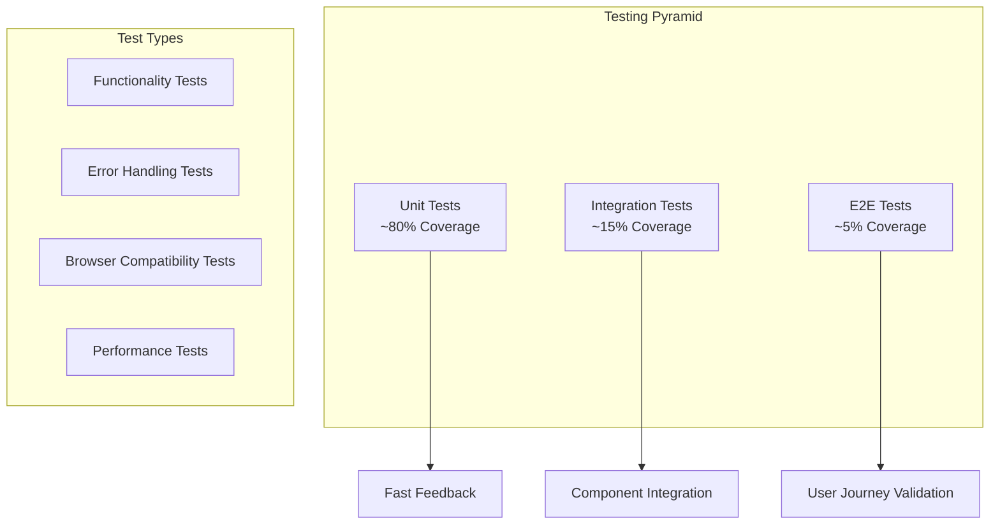
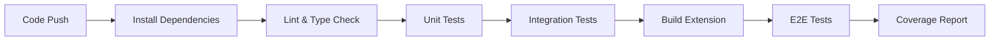
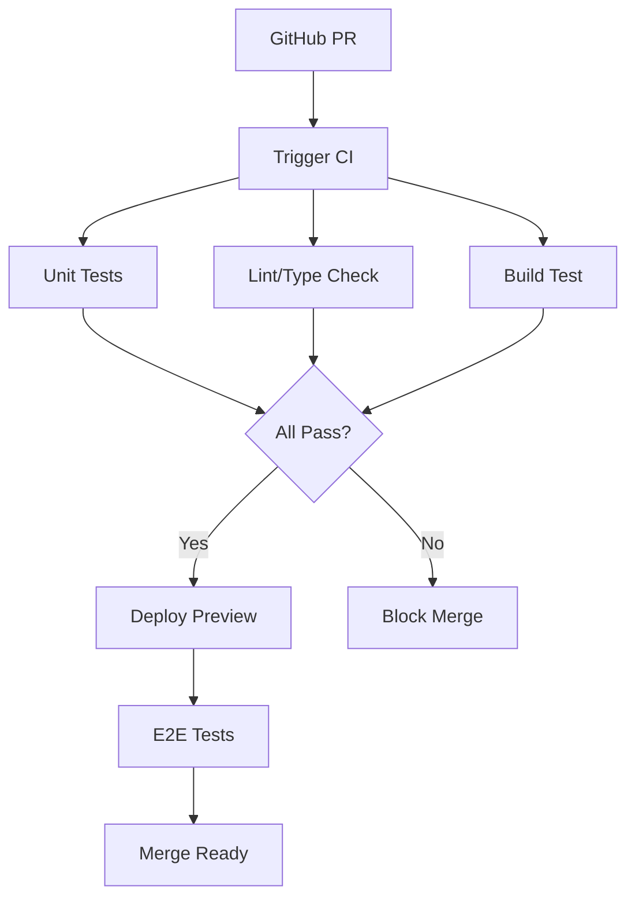

# Testing Strategy

HubMark employs comprehensive testing across all layers to ensure reliability, cross-browser compatibility, and robust error handling.

## Testing Philosophy



## Current Test Coverage

### Utilities Test Suite

| Utility | Tests | Coverage | Status |
|---------|--------|----------|---------|
| `storage.ts` | 17/17 | 100% | ✅ Passing |
| `github.ts` | 34/34 | 100% | ✅ Passing |
| `bookmarks.ts` | 24/24 | 100% | ✅ Passing |
| `sync.ts` | TBD | TBD | 🚧 Pending |

**Total: 75/75 tests passing (100%)**

## Test Architecture

```mermaid
graph LR
    subgraph "Test Framework Stack"
        A[Vitest<br/>Test Runner]
        B[@testing-library<br/>Component Testing]
        C[jsdom<br/>Browser Environment]
    end
    
    subgraph "Mock Strategy"
        D[Browser API Mocks]
        E[GitHub API Mocks]
        F[Storage Mocks]
    end
    
    A --> D
    B --> E
    C --> F
```

## Unit Testing Patterns

### 1. Browser API Mocking

**Storage API Mock**:
```typescript
const mockBrowser = {
  storage: {
    sync: {
      get: vi.fn().mockResolvedValue({}),
      set: vi.fn().mockResolvedValue(undefined),
      clear: vi.fn().mockResolvedValue(undefined),
    },
    local: {
      get: vi.fn().mockResolvedValue({}),
      set: vi.fn().mockResolvedValue(undefined),
      clear: vi.fn().mockResolvedValue(undefined),
    },
  },
};

global.browser = mockBrowser;
```

**Bookmarks API Mock**:
```typescript
const mockBookmarksAPI = {
  bookmarks: {
    getTree: vi.fn(),
    get: vi.fn(),
    getChildren: vi.fn(),
    create: vi.fn(),
    update: vi.fn(),
    remove: vi.fn(),
  },
};
```

### 2. GitHub API Mocking

**Octokit Mock Strategy**:
```typescript
const mockOctokit = {
  rest: {
    users: { getAuthenticated: vi.fn() },
    repos: {
      listForAuthenticatedUser: vi.fn(),
      createForAuthenticatedUser: vi.fn(),
      get: vi.fn(),
      createOrUpdateFileContents: vi.fn(),
      deleteFile: vi.fn(),
      getContent: vi.fn(),
    },
    git: { createRef: vi.fn() },
  },
};

vi.mock('@octokit/rest', () => ({
  Octokit: vi.fn(() => mockOctokit),
}));
```

### 3. Test Data Factories

**Bookmark Test Data**:
```typescript
const createMockBookmark = (overrides = {}): NormalizedBookmark => ({
  id: 'hm_test123',
  title: 'Test Bookmark',
  url: 'https://example.com',
  folderPath: 'Test Folder',
  tags: ['test'],
  notes: 'Test notes',
  dateAdded: Date.now(),
  dateModified: Date.now(),
  ...overrides,
});

const createBrowserBookmark = (overrides = {}): BrowserBookmark => ({
  id: 'browser_123',
  title: 'Test Bookmark #test (Test notes)',
  url: 'https://example.com',
  dateAdded: Date.now(),
  ...overrides,
});
```

## Test Categories

### 1. Functionality Tests

**CRUD Operations**:
```typescript
describe('Storage Manager CRUD', () => {
  it('should create and retrieve bookmark', async () => {
    const bookmark = createMockBookmark();
    await storageManager.addBookmark(bookmark);
    
    const retrieved = await storageManager.getBookmarks();
    expect(retrieved).toContain(expect.objectContaining({
      id: bookmark.id,
      title: bookmark.title,
    }));
  });
});
```

**Data Transformation**:
```typescript
describe('Markdown Generation', () => {
  it('should generate markdown with folder organization', () => {
    const bookmarks = [
      createMockBookmark({ folder: 'Development' }),
      createMockBookmark({ folder: 'Personal' }),
    ];
    
    const markdown = generateMarkdownContent(bookmarks, 'folder');
    
    expect(markdown).toContain('## Development');
    expect(markdown).toContain('## Personal');
  });
});
```

### 2. Error Handling Tests

**Network Failures**:
```typescript
describe('GitHub Client Error Handling', () => {
  it('should handle authentication failures gracefully', async () => {
    mockOctokit.rest.users.getAuthenticated
      .mockRejectedValue(new Error('Unauthorized'));
    
    await expect(github.authenticate())
      .rejects.toThrow('GitHub authentication failed: Unauthorized');
  });
  
  it('should handle rate limiting', async () => {
    const rateLimitError = new Error('Rate limit exceeded');
    rateLimitError.status = 429;
    
    mockOctokit.rest.repos.createOrUpdateFileContents
      .mockRejectedValue(rateLimitError);
    
    await expect(github.createFile('test.md', 'content', 'message'))
      .rejects.toThrow('Failed to create file: Rate limit exceeded');
  });
});
```

**Validation Errors**:
```typescript
describe('Bookmark Validation', () => {
  it('should reject bookmarks without titles', () => {
    expect(() => validateBookmarkData({ url: 'https://example.com' }))
      .toThrow('Bookmark title is required');
  });
  
  it('should reject invalid URLs', () => {
    expect(() => validateBookmarkData({ 
      title: 'Test',
      url: 'not-a-url' 
    })).toThrow('Invalid bookmark URL');
  });
});
```

### 3. Browser Compatibility Tests

**Cross-Browser ID Mapping**:
```typescript
describe('ID Stability', () => {
  it('should generate consistent IDs across browser sessions', () => {
    const bookmark1 = { url: 'https://example.com', title: 'Test' };
    const bookmark2 = { url: 'https://example.com', title: 'Test' };
    
    const id1 = generateStableId(bookmark1.url, bookmark1.title);
    const id2 = generateStableId(bookmark2.url, bookmark2.title);
    
    expect(id1.split('_')[1]).toBe(id2.split('_')[1]); // Hash part should match
  });
});
```

**Browser Detection**:
```typescript
describe('Browser Detection', () => {
  beforeEach(() => {
    // Mock different user agents
  });
  
  it('should detect Chrome correctly', () => {
    Object.defineProperty(navigator, 'userAgent', {
      value: 'Mozilla/5.0 Chrome/91.0.4472.124',
      configurable: true,
    });
    
    const manager = new BookmarkManager();
    expect(manager.browserType).toBe('chrome');
  });
});
```

### 4. Integration Tests

**Storage and GitHub Integration**:
```typescript
describe('End-to-End Sync Flow', () => {
  it('should sync bookmark from storage to GitHub', async () => {
    // Setup
    const bookmark = createMockBookmark();
    await storageManager.addBookmark(bookmark);
    
    // Mock successful GitHub operations
    mockOctokit.rest.repos.createOrUpdateFileContents
      .mockResolvedValue({ data: { content: { sha: 'abc123' } } });
    
    // Execute sync
    const storedBookmarks = await storageManager.getBookmarks();
    const markdown = generateMarkdownContent(storedBookmarks);
    await github.createFile('bookmarks.md', markdown, 'Sync bookmarks');
    
    // Verify
    expect(mockOctokit.rest.repos.createOrUpdateFileContents)
      .toHaveBeenCalledWith(expect.objectContaining({
        path: 'bookmarks.md',
        message: 'Sync bookmarks',
      }));
  });
});
```

## Test Configuration

### Vitest Setup

**`vitest.config.ts`**:
```typescript
export default defineConfig({
  plugins: [react()],
  test: {
    globals: true,
    environment: 'jsdom',
    setupFiles: ['./src/test/setup.ts'],
    coverage: {
      provider: 'v8',
      reporter: ['text', 'json', 'html'],
      exclude: [
        'node_modules/',
        '.output/',
        '.wxt/',
        'src/test/',
        '**/*.test.{ts,tsx}',
        '**/*.spec.{ts,tsx}',
      ]
    }
  },
});
```

**Test Setup File** (`src/test/setup.ts`):
```typescript
import '@testing-library/jest-dom';

// Global test utilities and mocks
global.browser = {
  storage: {
    sync: { get: vi.fn(), set: vi.fn(), clear: vi.fn() },
    local: { get: vi.fn(), set: vi.fn(), clear: vi.fn() }
  },
  bookmarks: {
    getTree: vi.fn(),
    create: vi.fn(),
    update: vi.fn(),
    remove: vi.fn()
  }
};
```

## Test Execution Strategy

### CI/CD Pipeline



### Local Development

```bash
# Run all tests
npm test

# Run specific test file
npm test utils/storage.test.ts

# Run with coverage
npm run test:coverage

# Watch mode for development
npm run test:watch
```

## Mock Strategies

### 1. API Response Mocking

**GitHub API Responses**:
```typescript
const mockRepositoryResponse = {
  id: 123,
  name: 'test-repo',
  full_name: 'user/test-repo',
  description: 'Test repository',
  private: true,
  default_branch: 'main',
  html_url: 'https://github.com/user/test-repo',
  clone_url: 'https://github.com/user/test-repo.git',
};

mockOctokit.rest.repos.get.mockResolvedValue({ 
  data: mockRepositoryResponse 
});
```

### 2. Async Operation Mocking

**Storage Operations**:
```typescript
beforeEach(() => {
  mockBrowser.storage.local.get.mockImplementation((key) => {
    const storage = {
      bookmarks: [],
      idMappings: [],
      lastSyncTime: 0,
    };
    return Promise.resolve({ [key]: storage[key] });
  });
});
```

### 3. Time-Dependent Tests

**Date Mocking**:
```typescript
beforeEach(() => {
  vi.useFakeTimers();
  vi.setSystemTime(new Date('2023-12-07'));
});

afterEach(() => {
  vi.useRealTimers();
});
```

## Performance Testing

### Memory Usage Tests

```typescript
describe('Memory Usage', () => {
  it('should not leak memory with large bookmark sets', async () => {
    const initialMemory = process.memoryUsage().heapUsed;
    
    // Process large bookmark set
    const largeBookmarkSet = Array.from({ length: 10000 }, (_, i) => 
      createMockBookmark({ id: `bookmark_${i}` })
    );
    
    await storageManager.saveBookmarks(largeBookmarkSet);
    
    // Force garbage collection
    if (global.gc) global.gc();
    
    const finalMemory = process.memoryUsage().heapUsed;
    const memoryIncrease = finalMemory - initialMemory;
    
    // Should not increase by more than 50MB for 10k bookmarks
    expect(memoryIncrease).toBeLessThan(50 * 1024 * 1024);
  });
});
```

### Timing Tests

```typescript
describe('Performance', () => {
  it('should process bookmark changes efficiently', async () => {
    const start = performance.now();
    
    const changes = manager.detectChanges(oldBookmarks, newBookmarks);
    
    const end = performance.now();
    const processingTime = end - start;
    
    // Should process 1000 bookmarks in under 100ms
    expect(processingTime).toBeLessThan(100);
  });
});
```

## Future Testing Enhancements

### Planned Additions

1. **Visual Regression Tests**: Screenshot comparisons for UI components
2. **Property-Based Tests**: Generative testing for edge cases  
3. **Mutation Testing**: Validate test quality
4. **Performance Benchmarks**: Automated performance regression detection
5. **Cross-Browser E2E**: Automated testing in Chrome, Firefox, Safari

### Test Automation



This comprehensive testing strategy ensures HubMark maintains high quality, reliability, and cross-browser compatibility throughout development.