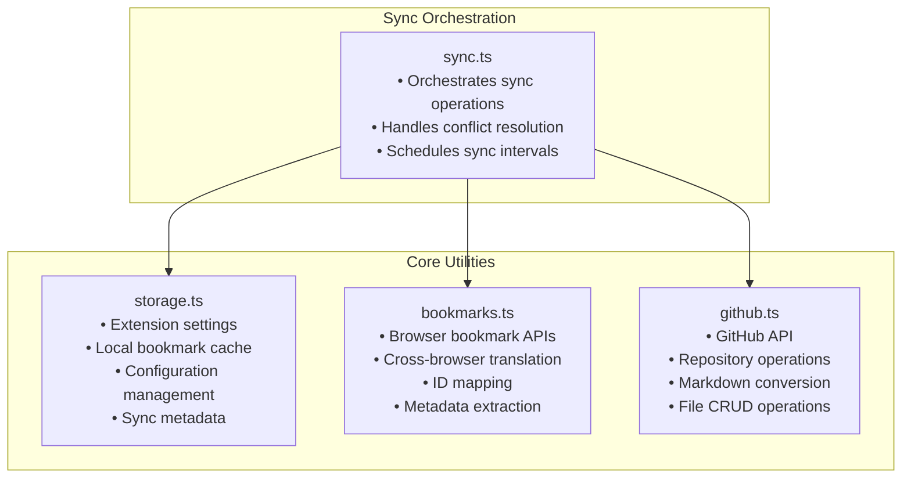
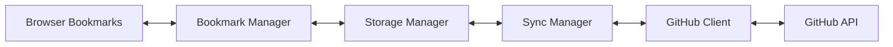

# Utilities Overview

The HubMark extension is built on four core utilities that handle different aspects of bookmark synchronization. Each utility is designed to be independent, testable, and focused on a single responsibility.

## Architecture Overview



## Utility Responsibilities

### 1. Storage Manager (`storage.ts`)

**Purpose**: Manages extension-specific storage and configuration

**Key Features**:
- Extension settings persistence
- GitHub configuration storage
- Local bookmark caching
- Sync metadata tracking

**Dependencies**: Browser Storage API

### 2. Bookmark Manager (`bookmarks.ts`)

**Purpose**: Provides unified interface to browser bookmark APIs across different browsers

**Key Features**:
- Cross-browser API abstraction
- Stable ID generation and mapping
- Metadata extraction from titles
- Browser bookmark CRUD operations
- Conflict resolution helpers

**Dependencies**: Browser Bookmarks API, Storage Manager

### 3. GitHub Client (`github.ts`)

**Purpose**: Handles all GitHub API operations and data transformation

**Key Features**:
- Repository management
- File operations (create, read, update, delete)
- Markdown generation and parsing
- Branch operations
- Authentication handling

**Dependencies**: Octokit REST API

### 4. Sync Manager (`sync.ts`) - *Coming Next*

**Purpose**: Orchestrates synchronization between browser bookmarks and GitHub

**Key Features**:
- Bi-directional sync coordination
- Change detection and merging
- Conflict resolution strategies
- Sync scheduling and queuing
- Error handling and retry logic

**Dependencies**: All other utilities

## Data Flow Between Utilities



### Example: Adding a New Bookmark

1. **Browser Event**: User adds bookmark in browser
2. **Bookmark Manager**: Detects change, normalizes format
3. **Storage Manager**: Caches bookmark locally with metadata
4. **Sync Manager**: Schedules sync operation
5. **GitHub Client**: Converts to Markdown, commits to repository

### Example: Syncing from GitHub

1. **Sync Manager**: Polls for changes or webhook triggered
2. **GitHub Client**: Fetches updated files, parses Markdown
3. **Storage Manager**: Compares with local cache
4. **Bookmark Manager**: Applies changes to browser bookmarks
5. **Storage Manager**: Updates cache and sync metadata

## Testing Strategy

Each utility has comprehensive unit tests covering:

- **Functionality**: All public methods and edge cases
- **Error Handling**: Network failures, API errors, invalid data
- **Browser Compatibility**: Mocked browser APIs for cross-browser testing
- **Integration Points**: Interactions between utilities

**Current Test Coverage**:
- `storage.ts`: 17/17 tests passing (100%)
- `bookmarks.ts`: 24/24 tests passing (100%)
- `github.ts`: 34/34 tests passing (100%)
- `sync.ts`: *Coming next*

## Usage Patterns

### Initialization
```typescript
import { storageManager } from '~/utils/storage';
import { bookmarkManager } from '~/utils/bookmarks';
import { GitHubClient } from '~/utils/github';

// Get GitHub config
const githubConfig = await storageManager.getGitHubConfig();
if (githubConfig) {
  const github = new GitHubClient(githubConfig);
}
```

### Safe Access Pattern
```typescript
// Always check for availability
if (bookmarkManager) {
  const bookmarks = await bookmarkManager.getAllBookmarks();
}
```

### Error Handling
```typescript
try {
  await github.createFile('bookmarks.md', content, 'Add new bookmarks');
} catch (error) {
  console.error('Sync failed:', error.message);
  // Queue for retry
}
```

## Next Steps

1. **Sync Manager Implementation**: Coordinate all utilities
2. **Background Service**: Run sync operations
3. **UI Components**: Settings and popup interfaces
4. **Extension Entry Points**: Connect UI to business logic