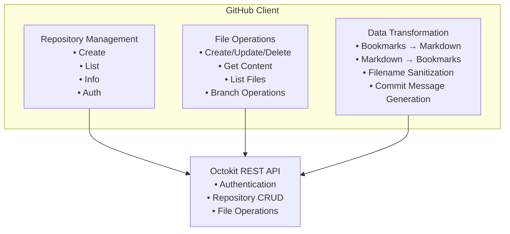

# GitHub Client Architecture

The GitHub Client (`utils/github.ts`) handles all GitHub API operations, repository management, and data format conversion between internal bookmarks and shareable Markdown files.

## Architecture Overview



## Core Responsibilities

### 1. Repository Management

**Authentication and Setup**:
```typescript
const github = new GitHubClient({
  token: 'ghp_...',
  repoOwner: 'username', 
  repoName: 'bookmarks'
});

// Verify token and permissions
const user = await github.authenticate();
console.log(`Authenticated as: ${user.login}`);
```

**Repository Operations**:
```typescript
// Create new bookmark repository
const repo = await github.createRepository({
  name: 'my-bookmarks',
  description: 'Bookmarks synced via HubMark',
  private: true,
  autoInit: true
});

// List user repositories  
const repos = await github.listRepositories('owner', 30);

// Get specific repository info
const info = await github.getRepositoryInfo('username', 'bookmarks');
```

### 2. File Operations

**CRUD Operations**:
```typescript
// Create new file
const file = await github.createFile(
  'bookmarks/development.md',
  markdownContent, 
  'feat: add development bookmarks'
);

// Update existing file  
const updated = await github.updateFile(
  'bookmarks/development.md',
  newContent,
  'chore: update React bookmarks',
  file.sha  // Required for updates
);

// Delete file
await github.deleteFile(
  'bookmarks/old.md',
  'chore: remove outdated bookmarks', 
  oldSha
);

// Read file content
const content = await github.getFileContent('bookmarks/development.md');
```

**Directory Operations**:
```typescript
// List files in directory
const files = await github.listFiles('bookmarks');

// List files in subdirectory  
const categoryFiles = await github.listFiles('bookmarks/categories');
```

### 3. Branch Management

```typescript
// Create feature branch
await github.createBranch('sync-updates');

// Create from specific commit
await github.createBranch('backup', 'abc123def456');

// Get branch info
const branch = await github.getBranch('main');
console.log(`Latest commit: ${branch.sha}`);
```

## Data Transformation Engine

### Bookmarks to Markdown Conversion

The system converts structured bookmark data into human-readable, shareable Markdown:

```typescript
const bookmarks: StoredBookmark[] = [
  {
    id: 'hm_abc123',
    title: 'React Documentation',
    url: 'https://reactjs.org',
    tags: ['react', 'javascript'],
    notes: 'Official React docs',
    folder: 'Development',
    dateAdded: 1234567890000,
    dateModified: 1234567890000
  }
];

const markdown = generateMarkdownContent(bookmarks, 'folder');
```

**Generated Output**:
```markdown
# Bookmarks

*Last updated: 2023-12-07*

## Development

- [React Documentation](https://reactjs.org)
  *Tags: react, javascript*
  *Notes: Official React docs*
  *Folder: Development*
```

### Organization Strategies

**By Folder** (Default):
```markdown
## Development
- [React Docs](https://reactjs.org)
- [Vue Guide](https://vuejs.org)

## Personal  
- [GitHub](https://github.com)
```

**By Date**:
```markdown
## 2023-12-07
- [New Bookmark](https://example.com)

## 2023-12-06  
- [Older Bookmark](https://old.com)
```

**By Tags**:
```markdown
## javascript
- [React Docs](https://reactjs.org)
- [Vue Guide](https://vuejs.org)

## python
- [Django Docs](https://djangoproject.com)
```

**Flat List**:
```markdown
- [React Docs](https://reactjs.org)
- [Vue Guide](https://vuejs.org)  
- [GitHub](https://github.com)
```

### JSON-First Architecture

**Important**: HubMark follows a JSON-first architecture where `bookmarks/data.json` is the source of truth and `bookmarks/README.md` is auto-generated for display purposes only. Markdown parsing has been removed to maintain data integrity and prevent synchronization conflicts.

The system only generates Markdown from JSON data - it never parses Markdown back to bookmarks.

## Utility Functions

### Filename Sanitization

```typescript
export function sanitizeFilename(title: string, maxLength = 50): string {
  return title
    .toLowerCase()
    .replace(/[^a-z0-9\s-]/g, '')    // Remove special chars
    .replace(/\s+/g, '-')            // Spaces to hyphens
    .replace(/-+/g, '-')             // Collapse hyphens
    .substring(0, maxLength)         // Limit length
    .replace(/^-|-$/g, '');          // Trim hyphens
}

// Examples:
sanitizeFilename('React & TypeScript Guide');
// → 'react-typescript-guide'

sanitizeFilename('My Awesome Bookmark!');  
// → 'my-awesome-bookmark'
```

### Commit Message Generation

```typescript
export function formatCommitMessage(
  operation: 'add' | 'update' | 'delete', 
  bookmarkTitle: string
): string {
  const shortTitle = bookmarkTitle.length > 50 
    ? `${bookmarkTitle.substr(0, 47)}...` 
    : bookmarkTitle;
  
  switch (operation) {
    case 'add':
      return `feat: add bookmark "${shortTitle}"`;
    case 'update':
      return `chore: update bookmark "${shortTitle}"`;
    case 'delete':
      return `chore: remove bookmark "${shortTitle}"`;
  }
}
```

**Examples**:
```
feat: add bookmark "React Documentation"
chore: update bookmark "Vue.js Guide - Updated"  
chore: remove bookmark "Outdated Tutorial"
```

### Token Validation

```typescript
export async function validateGitHubToken(token: string) {
  const tempClient = new Octokit({ auth: token });
  
  try {
    // Test authentication
    const { data: user } = await tempClient.rest.users.getAuthenticated();
    
    // Test repository access
    await tempClient.rest.repos.listForAuthenticatedUser({ per_page: 1 });
    
    return { login: user.login, name: user.name };
  } catch (error) {
    throw new Error(`Invalid GitHub token: ${error.message}`);
  }
}
```

## Error Handling Strategy

### Graceful Degradation

```typescript
async createFile(path: string, content: string, message: string): Promise<GitHubFile> {
  try {
    const { data: result } = await this.octokit.rest.repos.createOrUpdateFileContents({
      owner: this.config.repoOwner,
      repo: this.config.repoName,
      path,
      message,
      content: Buffer.from(content, 'utf8').toString('base64'),
    });

    return {
      content,
      sha: result.content!.sha,
      path: result.content!.path,
      encoding: 'utf8'
    };
  } catch (error: any) {
    // Provide context-specific error messages
    if (error.status === 404) {
      throw new Error(`Repository not found: ${this.config.repoOwner}/${this.config.repoName}`);
    }
    if (error.status === 422) {
      throw new Error(`File already exists: ${path}`);
    }
    throw new Error(`Failed to create file: ${error.message}`);
  }
}
```

### Network Resilience

Common error scenarios handled:

- **404**: Repository/file not found
- **401/403**: Authentication/permission errors  
- **422**: Validation errors (duplicate files, etc.)
- **409**: Merge conflicts
- **429**: Rate limiting
- **500+**: GitHub service errors

## Repository Structure Conventions

### Recommended Layout

```
my-bookmarks/
  README.md                 # Repository description
  bookmarks/
    development.md          # Development bookmarks
    personal.md             # Personal bookmarks  
    work.md                 # Work-related bookmarks
    categories/
      javascript.md         # Language-specific
      python.md
      tools.md
  archive/
    old-bookmarks.md        # Archived bookmarks
```

### File Naming Strategy

```typescript
// Generate filename from bookmark metadata
const filename = sanitizeFilename(bookmark.title || bookmark.folder || 'bookmarks');
const filepath = `bookmarks/${filename}.md`;
```

## API Integration Details

### Octokit Configuration

```typescript
export class GitHubClient {
  private octokit: Octokit;
  private config: GitHubConfig;

  constructor(config: GitHubConfig) {
    this.config = config;
    this.octokit = new Octokit({
      auth: config.token,
      // Optional: custom base URL for GitHub Enterprise
      baseUrl: 'https://api.github.com',
      // Request timeout and retry configuration
      request: {
        timeout: 10000,
        retries: 3,
      },
    });
  }
}
```

### Rate Limiting

GitHub API limits:
- **Authenticated**: 5,000 requests/hour
- **Search**: 30 requests/minute
- **Typical sync**: 5-10 requests per operation

**Implementation**:
```typescript
// Built into Octokit with automatic retry
// Custom rate limit handling can be added:
this.octokit.hook.error('request', async (error, options) => {
  if (error.status === 429) {
    const resetTime = error.response.headers['x-ratelimit-reset'];
    // Implement exponential backoff
  }
});
```

## Testing Strategy

The GitHub Client has 34 comprehensive tests covering:

1. **Repository Management**: Create, list, get info, authentication
2. **File Operations**: CRUD operations, content encoding/decoding
3. **Branch Operations**: Create, get branch info
4. **Data Transformation**: Markdown generation and parsing
5. **Utility Functions**: Filename sanitization, commit messages
6. **Error Scenarios**: Network failures, API errors, invalid data

### Mock Strategy

```typescript
const mockOctokit = {
  rest: {
    users: { getAuthenticated: vi.fn() },
    repos: {
      listForAuthenticatedUser: vi.fn(),
      createForAuthenticatedUser: vi.fn(),
      get: vi.fn(),
      createOrUpdateFileContents: vi.fn(),
      deleteFile: vi.fn(),
      getContent: vi.fn(),
    },
  },
};

vi.mock('@octokit/rest', () => ({
  Octokit: vi.fn(() => mockOctokit),
}));
```

## Performance Optimization

### Batch Operations

```typescript
// Instead of multiple single file operations:
// ❌ Slow
for (const bookmark of bookmarks) {
  await github.createFile(`${bookmark.id}.md`, content, message);
}

// ✅ Better - combine into single file
const combinedContent = generateMarkdownContent(bookmarks);
await github.createFile('bookmarks.md', combinedContent, 'Update all bookmarks');
```

### Caching Strategy

```typescript
class GitHubClient {
  private repositoryCache = new Map<string, RepositoryInfo>();
  private fileContentCache = new Map<string, { content: string; sha: string; timestamp: number }>();
  
  async getRepositoryInfo(owner: string, repo: string): Promise<RepositoryInfo> {
    const cacheKey = `${owner}/${repo}`;
    const cached = this.repositoryCache.get(cacheKey);
    
    if (cached && (Date.now() - cached.timestamp < 300000)) { // 5 min cache
      return cached;
    }
    
    const info = await this.fetchRepositoryInfo(owner, repo);
    this.repositoryCache.set(cacheKey, { ...info, timestamp: Date.now() });
    return info;
  }
}
```

### Content Diffing

```typescript
// Only update files that have actually changed
async updateFileIfChanged(path: string, newContent: string, message: string): Promise<GitHubFile | null> {
  try {
    const current = await this.getFileContent(path);
    
    if (current.content === newContent) {
      return null; // No changes needed
    }
    
    return await this.updateFile(path, newContent, message, current.sha);
  } catch (error) {
    if (error.message.includes('not found')) {
      // File doesn't exist, create it
      return await this.createFile(path, newContent, message);
    }
    throw error;
  }
}
```