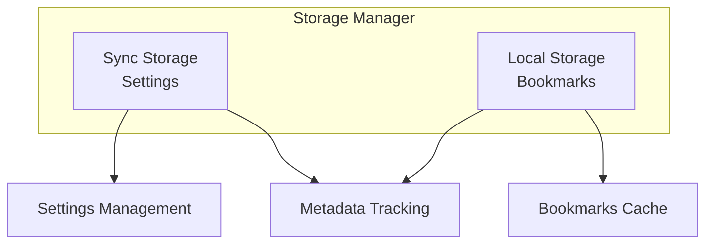

# Storage Manager Architecture

The Storage Manager (`utils/storage.ts`) provides a unified interface for managing extension data persistence across different storage areas and handles configuration management.

## Overview



## Data Storage Strategy

### Sync Storage (browser.storage.sync)
- **Purpose**: Small, synchronized data that follows the user
- **Limit**: ~100KB, synced across browser instances
- **Contents**:
  - GitHub configuration (token, repo details)
  - User preferences (sync interval, auto-sync settings)
  - Extension settings

### Local Storage (browser.storage.local)
- **Purpose**: Large datasets, device-specific cache
- **Limit**: ~10MB on most browsers
- **Contents**:
  - Cached bookmark data
  - Sync metadata (timestamps, conflict resolution)
  - ID mappings between browsers and HubMark

## Core Interfaces

### Configuration Types

```typescript
export interface GitHubConfig {
  token: string;        // Personal access token
  repoOwner: string;    // Repository owner username
  repoName: string;     // Repository name
}

export interface AppSettings {
  github?: GitHubConfig;    // GitHub integration settings
  syncInterval?: number;    // Sync frequency in milliseconds
  autoSync?: boolean;       // Enable automatic sync
}

export interface StoredBookmark {
  id: string;              // Stable HubMark ID
  title: string;           // Bookmark title
  url: string;             // Target URL
  tags?: string[];         // User-defined tags
  notes?: string;          // Additional notes
  dateAdded: number;       // Creation timestamp
  dateModified: number;    // Last modification timestamp
  folder?: string;         // Folder path
}
```

## Key Operations

### Settings Management

```typescript
// Load user settings
const settings = await storageManager.getSettings();

// Update specific setting
await storageManager.saveSettings({
  ...settings,
  autoSync: true,
  syncInterval: 300000  // 5 minutes
});

// GitHub-specific helpers
const githubConfig = await storageManager.getGitHubConfig();
await storageManager.saveGitHubConfig({
  token: 'ghp_...',
  repoOwner: 'username',
  repoName: 'bookmarks'
});
```

### Bookmark Management

```typescript
// Retrieve all cached bookmarks
const bookmarks = await storageManager.getBookmarks();

// Add new bookmark
await storageManager.addBookmark({
  id: 'hm_abc123',
  title: 'React Documentation',
  url: 'https://reactjs.org',
  tags: ['react', 'javascript'],
  dateAdded: Date.now(),
  dateModified: Date.now()
});

// Update existing bookmark
await storageManager.updateBookmark('hm_abc123', {
  title: 'React Docs - Updated',
  dateModified: Date.now()
});

// Remove bookmark
await storageManager.deleteBookmark('hm_abc123');
```

### Sync Metadata

```typescript
// Track sync operations
await storageManager.setLastSyncTime(Date.now());
const lastSync = await storageManager.getLastSyncTime();

// Clean slate for testing
await storageManager.clearAll();
```

## Error Handling

The Storage Manager implements robust error handling:

```typescript
class StorageManager {
  async getSettings(): Promise<AppSettings> {
    try {
      const result = await browser.storage.sync.get('settings');
      return result.settings || {};
    } catch (error) {
      console.error('Failed to load settings:', error);
      return {}; // Graceful degradation
    }
  }
}
```

## Browser Compatibility

### Storage Quotas
- **Chrome**: sync (100KB), local (10MB)
- **Firefox**: sync (100KB), local (10MB)  
- **Safari**: sync (1MB), local (10MB)
- **Edge**: sync (100KB), local (10MB)

### API Differences
- **Chrome**: Uses `chrome.storage` (legacy) or `browser.storage`
- **Firefox**: Uses `browser.storage` (WebExtensions standard)
- **Safari**: Uses `browser.storage` through polyfill

## Security Considerations

### Sensitive Data Handling
```typescript
// GitHub tokens are stored in sync storage
// but should be treated as sensitive
const config = await storageManager.getGitHubConfig();
if (config?.token) {
  // Token is available but never logged
  console.log('GitHub configured for:', config.repoOwner);
}
```

### Data Encryption
- Browser storage is encrypted at rest by the browser
- Tokens are never exposed in logs or error messages
- Repository data is public by design (user's choice)

## Performance Characteristics

### Read Operations
- **Settings**: <1ms (small sync storage)
- **Bookmarks**: 1-10ms (larger local storage)
- **Batch operations**: Efficient single calls

### Write Operations  
- **Individual**: 1-5ms average
- **Batch updates**: Preferred for multiple bookmarks
- **Cross-device sync**: 100-1000ms for sync storage

## Testing Strategy

The Storage Manager has 17 comprehensive unit tests covering:

1. **Settings CRUD**: Create, read, update settings
2. **GitHub Configuration**: Specialized config handling  
3. **Bookmark Operations**: Full lifecycle management
4. **Error Scenarios**: Storage failures, permission issues
5. **Edge Cases**: Empty states, malformed data

### Mock Strategy
```typescript
const mockBrowser = {
  storage: {
    sync: { get: vi.fn(), set: vi.fn(), clear: vi.fn() },
    local: { get: vi.fn(), set: vi.fn(), clear: vi.fn() }
  }
};

global.browser = mockBrowser;
```

## Usage Examples

### First-time Setup Flow
```typescript
// Check if user has configured GitHub
const githubConfig = await storageManager.getGitHubConfig();
if (!githubConfig) {
  // Show setup UI
  return showGitHubSetup();
}

// Verify token and repository access
const github = new GitHubClient(githubConfig);
try {
  await github.authenticate();
} catch (error) {
  // Token invalid, show re-auth
  return showTokenError();
}
```

### Sync Coordination
```typescript
// Load local bookmark cache
const localBookmarks = await storageManager.getBookmarks();

// Compare with browser bookmarks
const browserBookmarks = await bookmarkManager.getAllBookmarks();

// Detect changes and sync
const changes = detectChanges(localBookmarks, browserBookmarks);
if (changes.length > 0) {
  await syncChangesToGitHub(changes);
  await storageManager.setLastSyncTime(Date.now());
}
```